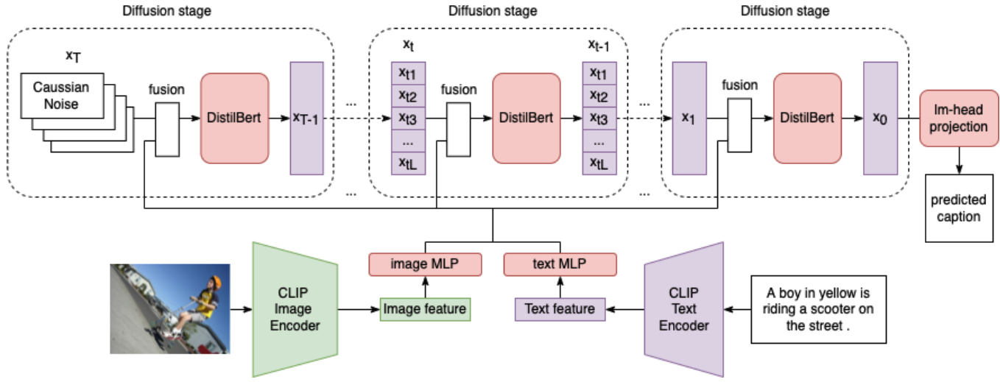

# Diffusion based Image Captioning

Research project on image captioning using diffusion language model. Our model is named as CLIP-DiffusionLM.

Inspired by the recent success of the denoising diffusion model on image synthesis tasks, we apply denoising diffusion probabilistic models to text generation in image captioning tasks. We show that our CLIP-Diffusion-LM is capable of generating image captions using significantly fewer inference steps than autoregressive models. On the Flickr8k dataset, the model achieves 0.1876 BLEU-4 score. By training on the combined Flickr8k and Flickr30k dataset, our model achieves 0.2470 BLEU-4 score.

## Dataset

We provide the extracted CLIP feature for Flickr8k dataset in repo https://github.com/xu-shitong/flickr8k-CLIP-freature} and can be downloaded as shown in CLIP-DDPM.ipynb file. However, due to file size limit, we do not disclose extracted CLIP feature for Flickr30k dataset. User will need to extract their own.

## Model Training

Best model hyperparameter config and training code is in CLIP-DDPM.py file. The model uses configuration of maximum output caption 16, $x_0$-prediction, $\lambda = 0.3$, $lr$ linear decay from 1e-4 to 5e-5, concatenation fusion and non-classification-free guidance. Training time is 5 hours for 15 epochs on Flickr8k and 11 hours for 10 epochs on Flickr30+8k using AdamW optimizer on a single Nvidia A30 GPU.

## Acknowledgments
We thank Mu Li and Yi Zhu for sharing their insight in various models in vision and NLP field publicly online, Boyang Gu for providing advice in early stage of the research. The computation resource was supported by Imperial College London. 
